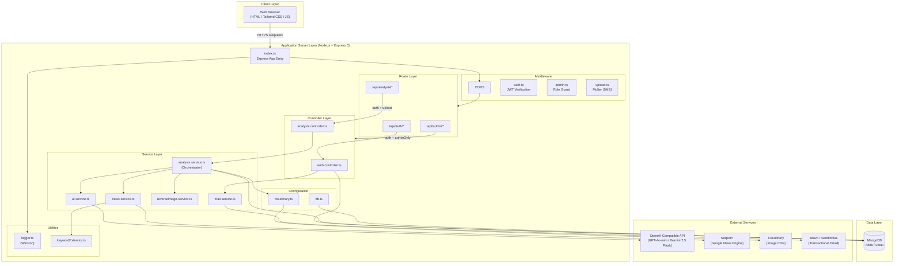
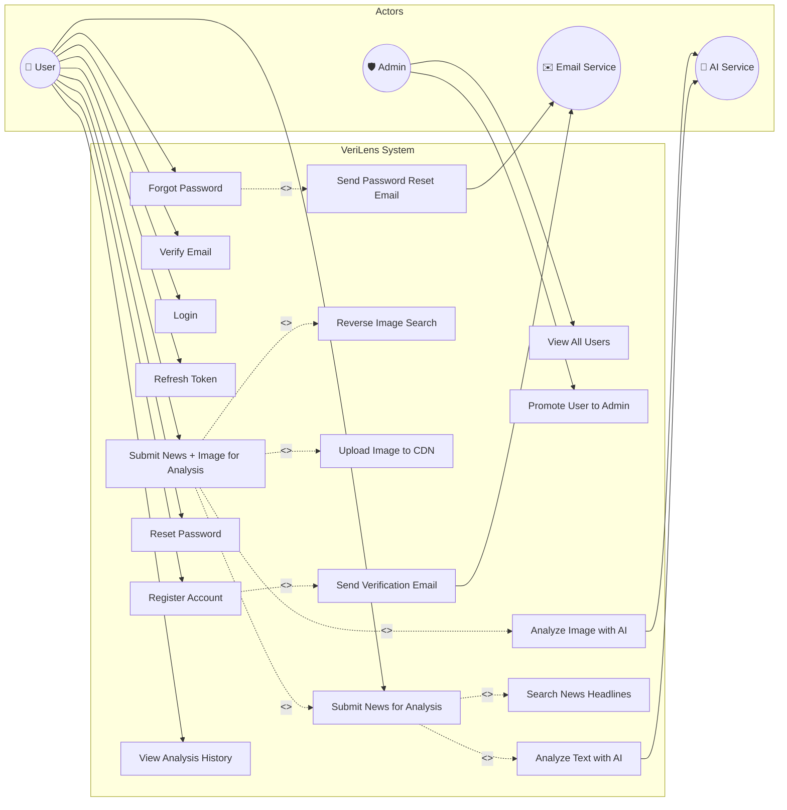
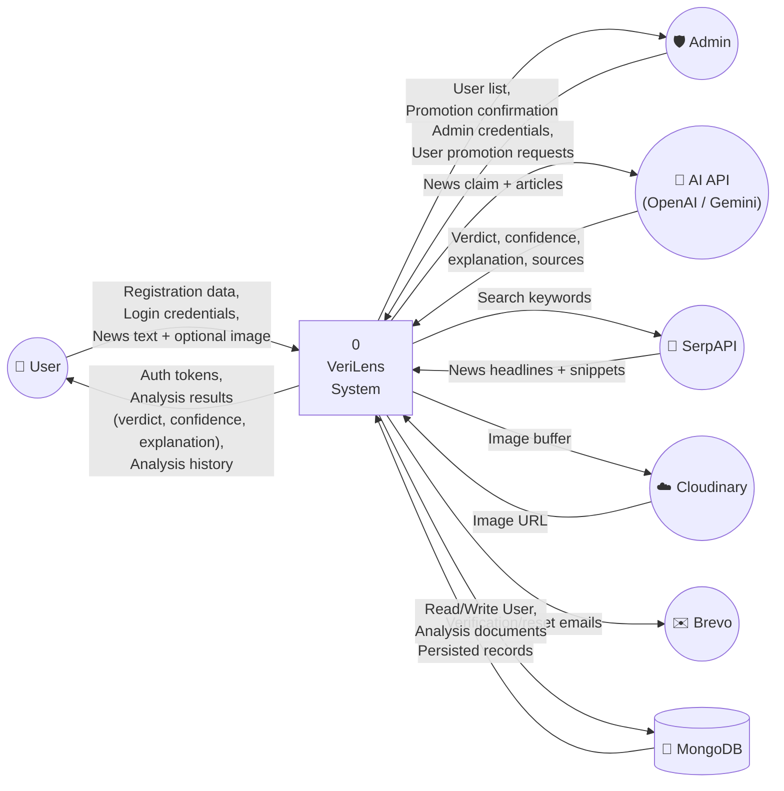
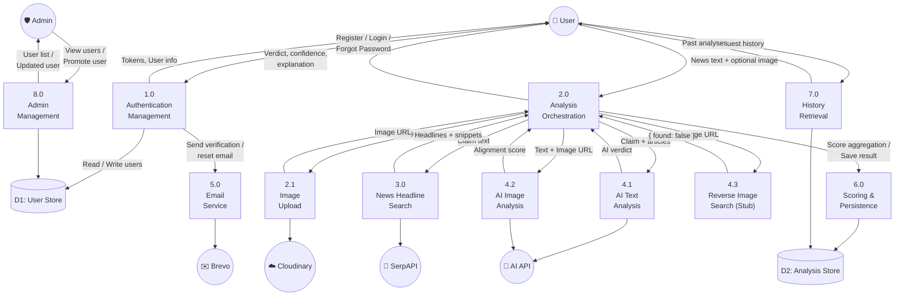
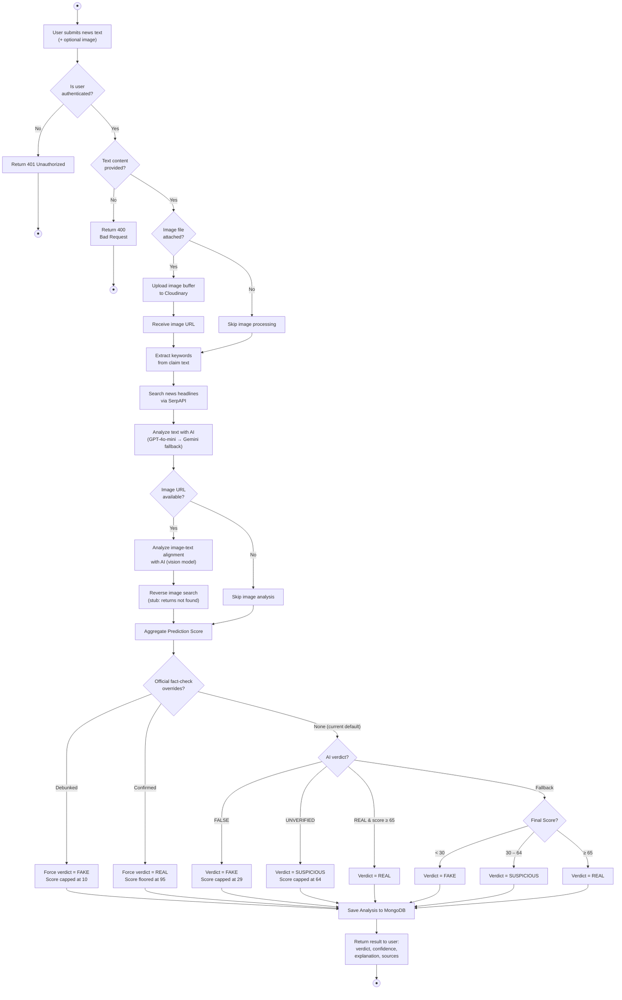
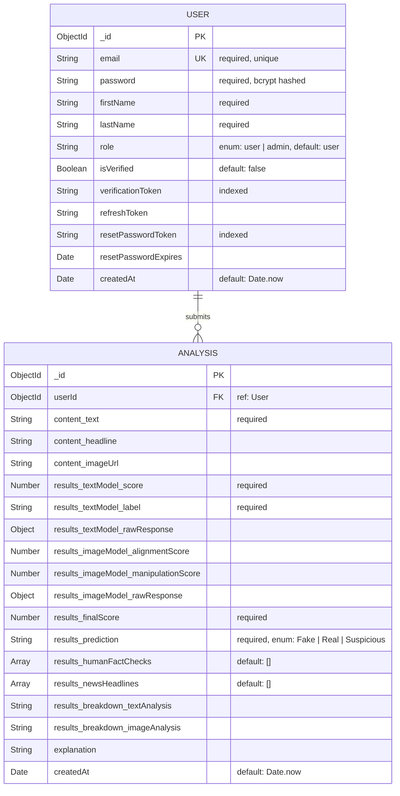
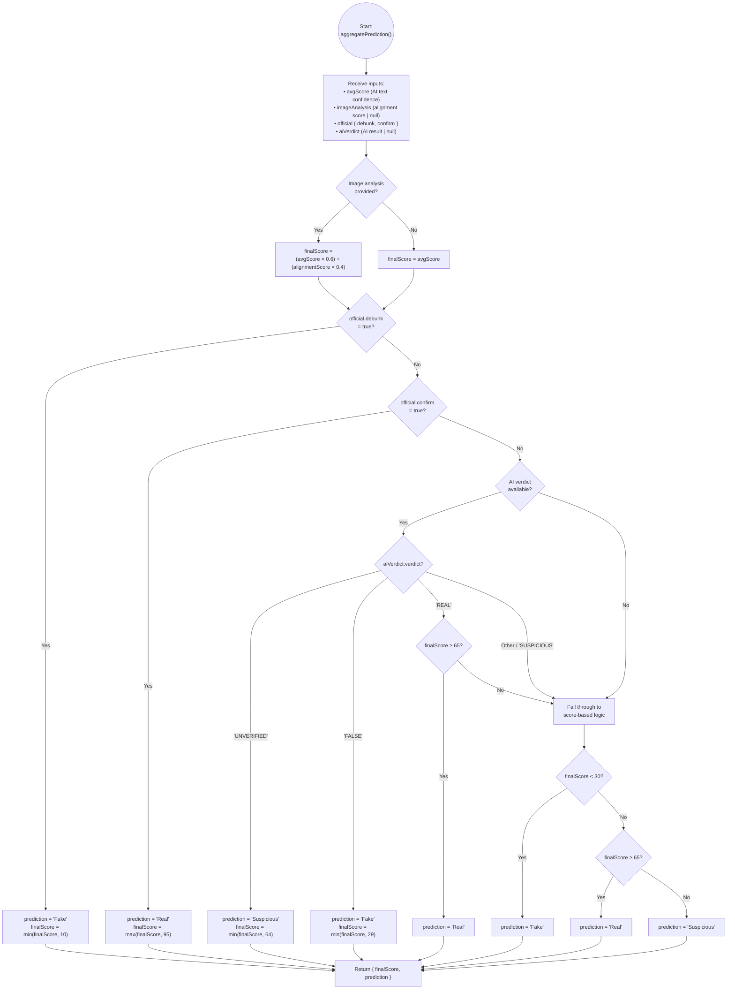

# VeriLens — System Diagrams

> All diagrams below are derived from the actual codebase at [src/](file:///C:/Users/MUSTAPHA/Documents/Fake%20News%20Detection%20System/src).

---

## 1. System Architecture Diagram

High-level view of all system components, their layers, and external service integrations.

---

## 2. Use Case Diagram

Actors and their interactions with the VeriLens system.

---

## 3. DFD Level 0 (Context Diagram)

The entire system as a single process with all external entities.

---

## 4. DFD Level 1

Decomposition of the VeriLens system into its major internal processes.

---

## 5. Activity Diagram

End-to-end flow for the **News Analysis** use case (the core feature).

---

## 6. Entity-Relationship Diagram (ERD)

Database schema showing the two MongoDB collections and their relationship.

---

## 7. Algorithm Flowchart

The **core scoring and prediction algorithm** from [analysis.service.ts](file:///C:/Users/MUSTAPHA/Documents/Fake%20News%20Detection%20System/src/Services/analysis.service.ts).

---

## Diagram Summary

| # | Diagram | Purpose |
|---|---------|---------|
| 1 | **System Architecture** | Shows all layers (Client → Middleware → Routes → Controllers → Services → DB) and external API integrations |
| 2 | **Use Case** | Maps actor interactions: User (auth, analysis, history), Admin (user management), AI & Email as supporting actors |
| 3 | **DFD Level 0** | Context diagram — VeriLens as a black box with all external entities and data flows |
| 4 | **DFD Level 1** | Decomposes the system into 8 internal processes with data stores and external entity connections |
| 5 | **Activity Diagram** | Step-by-step flow for the core news analysis feature, including all decision points |
| 6 | **ERD** | Two MongoDB collections (User, Analysis) with all fields, types, constraints, and the 1:N relationship |
| 7 | **Algorithm Flowchart** | The `aggregatePrediction()` scoring algorithm decision tree with exact thresholds (30/65) and override logic |

> [!NOTE]
> All diagrams use Mermaid syntax and can be rendered in any Mermaid-compatible viewer (GitHub, VS Code with Markdown Preview Mermaid extension, etc.).

> [!IMPORTANT]
> The **Reverse Image Search** service is currently a **stub** (always returns `{ found: false }`). The **Official Fact-Check** integration is **commented out** — `aggregatePrediction` always receives `{ debunk: false, confirm: false }`, making those branches dead code in the current implementation.
